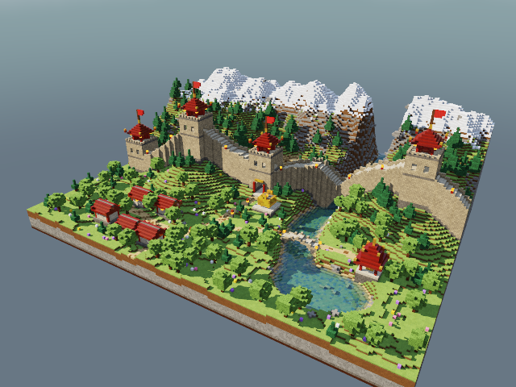
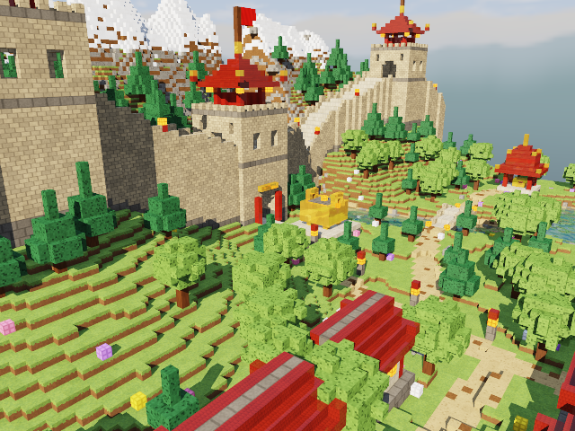
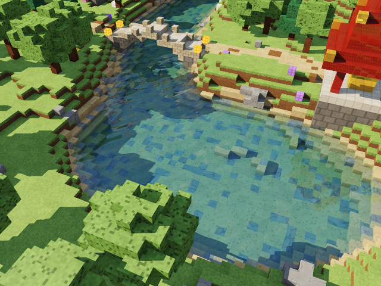
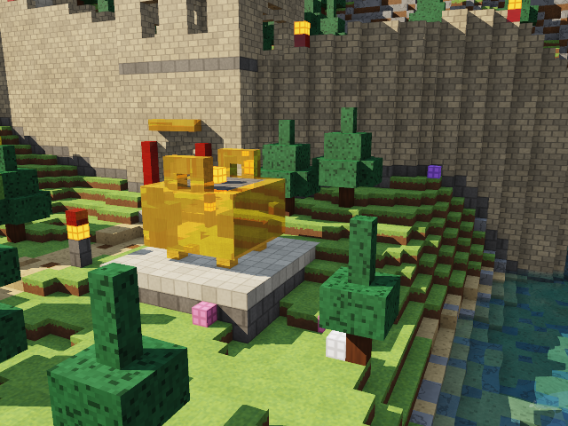

# Proyecto 2: Diorama con Raytracing — Gran Muralla China

**CC2018 Gráficas por Computadora · Universidad del Valle de Guatemala · 2026**



## Descripción

El proyecto presenta un diorama voxel inspirado en la Gran Muralla China, renderizado en tiempo real con un raytracer por software escrito desde cero en Rust.

La muralla serpentea sobre un paisaje de colinas y una cordillera nevada. Su camino sube y baja con el terreno mediante escalones de bloques. La escena incluye:

- cuatro torres de vigilancia con pabellones de tejas, aleros curvados, remates dorados, faroles y banderas;
- una puerta principal en arco con plaza y un incensario *ding* de oro pulido;
- un río que nace en un desfiladero, cae en cascada, cruza bajo la muralla por una puerta de agua y desemboca en un lago;
- un puente de piedra, una aldea de cinco casas y un pabellón junto al lago;
- caminos, pinos, árboles frondosos, rocas y flores.

## Tecnologías

| Componente | Uso |
|---|---|
| Rust (edición 2021) | Lenguaje del proyecto |
| `minifb` 0.28 | Ventana y entrega del framebuffer a pantalla |
| `nalgebra-glm` 0.19 | Vectores (`Vec3`) y operaciones algebraicas |
| `std` | Hilos, sincronización, archivos y todo lo demás |

El proyecto no usa ninguna otra dependencia. El raytracer, el recorrido de voxeles, las texturas, el skybox, el ruido procedural, la paralelización y el escritor PNG son implementación propia.

## Características

- **Raytracing por software:** un rayo primario por píxel, con rayos secundarios de sombra, reflexión y refracción.
- **Grilla de voxeles:** 192 × 80 × 144 celdas, con 1 byte por celda.
- **Recorrido DDA:** algoritmo de Amanatides y Woo, con recorte previo contra el AABB de la grilla.
- **Salto de espacio vacío:** campo de distancias de Chebyshev (*proximity clouds*).
- **Cámara orbital:** rotación horizontal y vertical, zoom y movimiento suavizado.
- **Materiales:** 20 materiales con albedo, especular, brillo, reflectividad, transparencia, IOR y emisión.
- **Texturas procedurales:** ladrillos, losas, tejas, césped, roca, agua, metal, madera y otras.
- **Iluminación:** sol direccional con Blinn-Phong, ambiente hemisférico, oclusión ambiental por voxel y tone mapping ACES.
- **Sombras:** shadow rays trazados contra la misma grilla.
- **Reflexión:** recursiva, con profundidad máxima de 3.
- **Refracción:** ley de Snell, Fresnel de Schlick, reflexión total interna y absorción de Beer-Lambert.
- **Skybox procedural:** cubemap de 6 caras con degradado, nubes, cordilleras lejanas y sol.
- **Paralelización:** `std::thread::scope` con reparto dinámico de bandas de filas.
- **Resolución dinámica:** preview a 320 × 240 en movimiento y 640 × 480 con antialiasing progresivo de 5 muestras al detenerse.
- **Exportación de imágenes:** capturas y cuadros PNG para el video, sin librerías externas.

## Controles

```text
A / D  o  ← / →        rotar alrededor del diorama
W / S  o  ↑ / ↓        inclinar la cámara
+ / -  ,  E / Q, rueda  zoom
R                       reiniciar la cámara
P                       guardar captura PNG
ESC                     salir
```

## Ejecución

```bash
cargo run --release
```

Opciones adicionales:

```bash
# Render de un cuadro a PNG (yaw,pitch,distancia[,objetivo x,y,z])
cargo run --release -- --render salida.png --view 0.55,0.48,215

# Exportar una órbita de 240 cuadros a la carpeta frames/
cargo run --release -- --export-frames 240

# Medir el tiempo promedio de render
cargo run --release -- --bench
```

Para unir los cuadros en un video:

```bash
ffmpeg -framerate 30 -i frames/frame_%04d.png -pix_fmt yuv420p diorama.mp4
```

## Video

Video del proyecto: [diorama.mp4](diorama.mp4)

---

## Capturas

| Muralla y torres | Refracción en el lago | Reflexión en el oro |
|---|---|---|
|  |  |  |

## Arquitectura

```text
src/
├── main.rs          punto de entrada, bucle de ventana, render a archivo, exportación y benchmark
├── camera.rs        cámara orbital y generación de rayos primarios
├── ray.rs           rayo paramétrico P(t) = O + tD
├── voxel.rs         celda de la grilla (material_id; 0 = aire)
├── voxel_grid.rs    grilla 3D, intersección con AABB, DDA y campo de distancias
├── material.rs      tabla de materiales y sus parámetros
├── texture.rs       texturas procedurales y normal ondulada del agua
├── noise.rs         hash, value noise y fBm deterministas
├── lighting.rs      sol, ambiente, shadow rays y oclusión ambiental
├── raytracer.rs     trazado recursivo: sombreado, reflexión, refracción y Fresnel
├── skybox.rs        cubemap procedural de 6 caras
├── scene_wall.rs    construcción del diorama por capas
├── renderer.rs      framebuffer, tone mapping, antialiasing y paralelización
├── input.rs         teclado y rueda del mouse
└── image_export.rs  escritor PNG con std (deflate sin compresión, CRC32 y Adler32)
```

Flujo de cada píxel:

```text
Cámara → Rayo → DDA en la grilla → Impacto (celda, normal, t)
       → Material + textura → Luz ambiental × oclusión
       → Shadow ray → Difuso + especular
       → Reflexión / refracción recursiva (profundidad ≤ 3)
       → Tone mapping ACES + gamma → Píxel
```

## Funcionamiento técnico

### Cámara
La cámara orbita alrededor de un objetivo sobre una esfera de radio `distance`, en coordenadas esféricas (`yaw`, `pitch`). Cada cuadro construye una base ortonormal (`forward`, `right`, `up`). El rayo primario atraviesa el plano de imagen según el campo de visión y la relación de aspecto. Las entradas del teclado modifican valores objetivo, y la cámara interpola hacia ellos con un factor exponencial para lograr un movimiento suave.

### Intersección con voxeles
Primero, el método de *slabs* recorta el rayo contra el AABB de la grilla. Después, el DDA de Amanatides y Woo avanza celda por celda. Para cada eje guarda `tMax`, el `t` del próximo cruce de frontera, y `tDelta`, el `t` necesario para cruzar una celda completa. Cada paso elige el eje con menor `tMax`. Así, el costo depende de las celdas atravesadas y no del total de bloques. El eje del último paso define la normal de la cara impactada, de modo que las caras ocultas nunca se procesan.

### Salto de espacio vacío
Al construir la escena, tres pasadas separables calculan para cada celda la distancia de Chebyshev a la celda ocupada más cercana, con tope de 12. Si un rayo que viaja por el aire entra a una celda con distancia `d`, avanza `d − 1` unidades sin riesgo de atravesar geometría y reinicia el DDA en ese punto. Este salto redujo el tiempo promedio de 76 ms a unos 50 ms por cuadro, medido sobre la misma escena.

### Materiales y texturas
Cada voxel guarda un `material_id`. La tabla de materiales define albedo, especular, exponente de brillo, reflectividad, transparencia, IOR, emisión y textura. Los cinco materiales principales son:

| Material | Especular | Reflectividad | Transparencia | IOR |
|---|---:|---:|---:|---:|
| Piedra de la muralla | 0.06 | 0.00 | 0.00 | — |
| Tejas vidriadas | 0.45 | 0.06 | 0.00 | — |
| Césped | 0.02 | 0.00 | 0.00 | — |
| Agua | 1.20 | Fresnel | 0.90 | 1.33 |
| Oro pulido | 1.00 | 0.72 | 0.00 | — |

Las texturas se calculan en el punto de impacto con coordenadas UV de la cara y ruido determinista: ladrillos con mortero y desgaste, losas, tejas en filas, césped con borde de tierra en los costados, vetas de madera, grietas en la roca y pétalos en las flores. Cada bloque recibe además una variación de tono por hash, para que no haya dos bloques iguales.

### Iluminación y sombras
Cada punto recibe tres aportes:

- **Ambiente hemisférico:** mezcla del color del cielo y del rebote del suelo según la normal, atenuada por la oclusión ambiental por voxel (los 8 vecinos de la cara, interpolados).
- **Sol:** difuso de Lambert y especular de Blinn-Phong.
- **Sombra:** un shadow ray hacia el sol decide si la luz llega. Si el rayo cruza el agua, solo se atenúa, y así el lecho del río conserva su iluminación.

### Reflexión
Para los materiales reflectivos se lanza el rayo `R = I − 2(I·N)N` y el resultado se mezcla según la reflectividad. En los metales, el reflejo se tiñe con el albedo. La recursión termina en `MAX_DEPTH = 3`.

### Refracción y ley de Snell
Cada rayo conoce el medio por el que viaja (aire o agua). El DDA se detiene en la primera celda de otro material, así que detecta tanto la entrada como la salida del agua. En la interfaz:

- **Ley de Snell:** `η = n₁ / n₂` y `k = 1 − η²(1 − cos²θᵢ)`. Si `k < 0`, se supera el ángulo crítico y ocurre **reflexión total interna**. Si no, `T = ηI + (η cosθᵢ − √k)N`.
- **Fresnel de Schlick:** reparte la energía entre reflexión y refracción según el ángulo de incidencia.
- **Beer-Lambert:** `exp(−k·d)` absorbe primero el rojo y tiñe el agua de verde azulado según la distancia recorrida.
- **Olas:** una suma de ondas senoidales perturba la normal de la superficie y deforma visiblemente el lecho del río.

### Skybox
Al iniciar, el programa genera un cubemap de 6 caras de 256 × 256 texeles, una cara por hilo. Cada texel evalúa un degradado del horizonte al cénit, nubes con fBm proyectadas sobre un plano, dos capas de cordilleras lejanas con bruma y el resplandor del sol. El muestreo elige la cara según el eje dominante de la dirección e interpola de forma bilineal. El disco solar se dibuja de forma analítica para mantener el borde nítido.

### Paralelización
`std::thread::scope` lanza tantos hilos como indique `available_parallelism()`. El framebuffer se divide en bandas de 4 filas, y cada hilo toma la siguiente banda libre de una cola protegida por `Mutex`. Así las filas de cielo, más baratas, no desbalancean la carga. El préstamo de los buffers es seguro y no requiere `unsafe`.

## Rendimiento

Medición con `--bench` en un CPU de 8 hilos lógicos, a 640 × 480 y una muestra por píxel:

| Etapa | Tiempo promedio |
|---|---:|
| Un hilo (vista general) | ≈ 330 ms |
| 8 hilos | ≈ 76 ms |
| 8 hilos + salto de espacio vacío | ≈ 35–55 ms |

## Cobertura de la rúbrica

| Requisito | Implementación |
|---|---|
| Complejidad de escena | Terreno, cordillera, muralla con escaleras y almenas, 4 torres, puerta, puerta de agua, río, cascada, lago, puente, aldea, pabellón, ding, faroles, árboles, rocas y flores |
| Atractivo visual | Texturas procedurales, oclusión ambiental, sombras, ACES, antialiasing y skybox |
| Rotación y zoom | Cámara orbital suavizada con teclado y rueda del mouse |
| 5 materiales | Piedra, tejas, césped, agua y oro, más 15 complementarios |
| Refracción | Agua con Snell, IOR 1.33, Fresnel, reflexión total interna y absorción |
| Reflexión | Oro pulido, tejas, madera lacada y agua, con recursión limitada |
| Skybox | Cubemap procedural de 6 caras |
